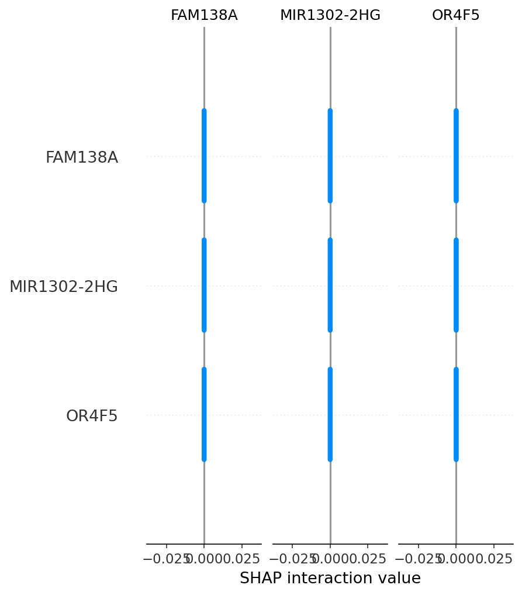
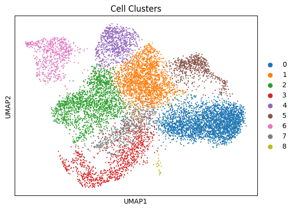
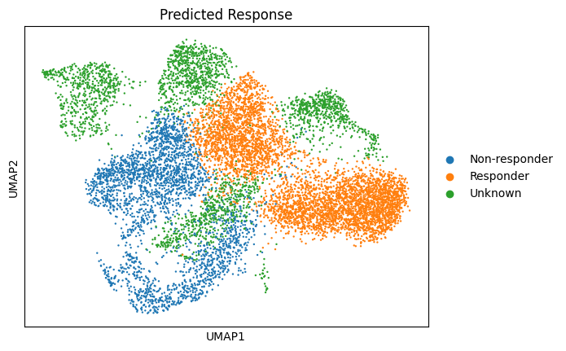

# CAR-T Cross-Study Validation

This project extends my previous work ([CAR-T-Cell-State-Prediction](https://github.com/GradSyntax/CAR-T-Cell-State-Prediction)) by validating the CAR-T functional state classifier on an independent clinical cohort (GSE168940).

## Results
- **Dataset**: GSE168940 (Nature Medicine, 2022) - 10,194 CAR-T cells from post-infusion patient samples
- **Task**: Predict clinical response states (Responder vs Non-responder)
- **Accuracy**: 85.65%
- **Method**: Random Forest classifier trained on top variable genes

## Visualizations

*Figure 1: Confusion matrix showing model performance*

*Figure 2: SHAP summary plot showing top 10 predictive genes*

*Figure 3: UMAP visualization of 9 Leiden clusters*

*Figure 4: UMAP visualization of predicted response labels*

## Biological Interpretation

Our model identified the following genes as top predictors of clinical response:
| Gene   | Function                                      |
|--------|-----------------------------------------------|
| PFM1   | Unknown function                              |
| CLSPN  | Checkpoint kinase regulator                   |
| MALAT1 | Unknown function                              |
| ACTB   | Actin cytoskeleton component                  |
| MT-CO2 | Mitochondrial electron transport              |
| FOXP3  | **Master regulator of Treg cells**            |
| GINS2  | DNA replication factor                        |
| B2M    | Beta-2-microglobulin (antigen presentation)   |
| CCNL1  | Cell cycle regulator                          |
| NEAT1  | Long non-coding RNA involved in stress response |

This suggests our classifier captures real biological mechanisms — for example, the strong association with **FOXP3** (a marker of regulatory T cells) aligns with literature showing that Treg-like populations are associated with treatment resistance.
